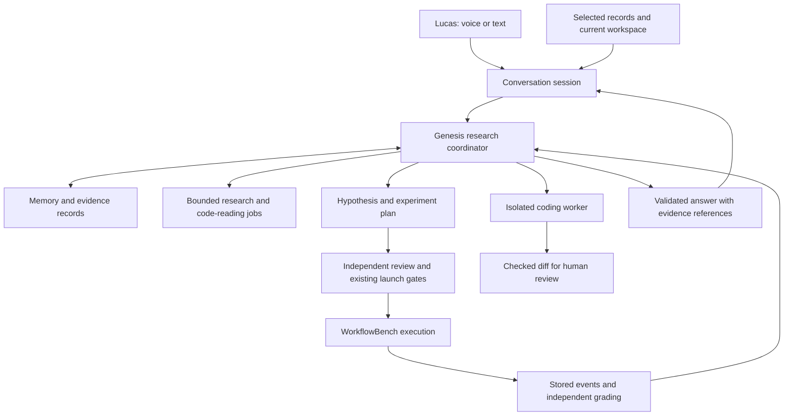

# Genesis research harness review

Genesis should become Monarch's persistent research colleague: a capable scientist and engineering coordinator with a warm female voice, concise answers, and a reliable understanding of the lab's current work. The strongest path is to retain WorkflowBench's evidence, accounting, and experiment controls, strengthen Genesis's reasoning and continuity, and attach a conversational voice surface to that same system.

Replacing Genesis wholesale with Hermes is not justified by the evidence. Hermes is the closest useful reference for a persistent personal agent; specialized research systems contribute better patterns for literature review, hypothesis testing, and evidence management. No public evaluation establishes a single best harness across these requirements. The recommendation below is an architectural judgment to test, not a claim of demonstrated superiority.

## 1. Scope and evidence

This assessment covers the local checkout on 11 September 2026 at base commit `c6432786f11c0663a8145fd7d2a4f2b2a303ada6`, including existing uncommitted edits. It is not a certification of the deployed Studio. The checkout contains concurrent work; findings refer to the inspected files, and the accompanying [evidence record](genesis-harness-review-2026-09-11-evidence.json) records their hashes. The required Graphify report was absent, so architecture claims are grounded in source.

The research builds on the September 9 code-aware memory report, the September 10 deep dive and team-scientist design, and the September 11 engineer, architecture-search, and voice designs. Its purpose is to verify and extend those findings, particularly where recent code or vendor capabilities change the answer. The [source matrix](genesis-harness-review-2026-09-11-sources.md) distinguishes research papers, engineering disclosures, documentation, and repository claims, including access limits and transfer conditions. Bracketed source numbers throughout refer to that matrix.

Four existing offline suites passed: **56 tests in 2.72 seconds**, covering the Genesis loop, people, memory, and speech transcription. No paid benchmark or model experiment was launched. Voice quality, end-to-end latency, live provider access, deployed configuration, and demonstrated Monarch improvement were not measured. Passing these tests establishes only the behaviors they cover.

## 2. What Genesis is trying to achieve

The intended research cycle is coherent: read previous work and current evidence, identify a failure mechanism, form a falsifiable hypothesis, prepare a controlled experiment, obtain the required authorization, execute, inspect the stored outcome, and recommend an engineering change. The engineer loop adds a concrete handoff: a specification, a checked diff, and verification output. Conversation makes those activities accessible to Lucas without requiring him to navigate every record manually.

Genesis's dedication to Monarch should mean improving its actual reliability and usefulness. An experiment that disproves an attractive idea, identifies a defective measurement, or prevents a wasted round advances that mission. Optimizing for favorable scores, producing many cards, or making the lab sound successful would undermine it. The September 7 direction and the final September 10 immutability decision are the governing constraints.

The two benchmark tracks remain distinct: one-off agentic requests and workflow creation plus execution. Genesis is the lab operator and analyst; evaluated competitors remain isolated from its research memory, answer keys, grading rules, snapshots, and other competitors' traces. A custom Genesis API loop does not replace the native harness required for a headline GPT or Claude competitor.

## 3. Implementation assessment

The implementation has valuable foundations. `genesis_harness.py` uses typed tools and provider adapters, reserves requests before dispatch, retains usage receipts, and leaves unknown costs reserved. The library distinguishes discovery metadata from fetched material. Memory has a small always-present layer and a searchable record, with optional vectors already implemented. Hypotheses, reviews, versioned architecture proposals, server-computed figures, code indexing, and a worktree-based engineering handoff also exist.

These are implemented mechanisms, not merely a design document. They are also not proof that the whole scientific cycle runs reliably or improves Monarch. Source paths below are relative to `monarch-benchmark/workflowbench/wb_studio/`.

| Priority | Observed implementation | Practical consequence | Recommended change |
|---|---|---|---|
| High | `genesis_config.py:31–40,100–107` defaults most steps, including chat, to the cheapest keyed route; “strongest” means highest input-plus-output price. | Conversation and synthesis can receive a weak model; price is not evidence of capability. An unavailable configured route can change the effective model. | Use explicit, capability-qualified routes and documented fallback behavior, selected on representative lab tasks. |
| High | `genesis_harness.py:39–42,118–127` caps a turn at 24 requests/15 minutes and reconstructs at most eight parent exchanges within a character limit. `genesis.py:128–136` marks interrupted work failed on restart. | Stored history is not resumable research execution. A long investigation can lose its active plan and tool context. | Add durable research jobs with checkpoints, evidence references, and safe resumption between bounded turns. |
| High | `memory.py:28–49` seeds SOUL with “never spend” and “never launch”; `GENESIS.md` describes authorized smoke launches and gives SOUL precedence. | A fresh instance receives contradictory instructions. The installed identity may differ; it was not assumed to equal this default. | Separate human-owned personality from machine-enforced policy and generate capability descriptions from current permissions. |
| High | `genesis_harness.py:204` supplies the complete tool set to every turn. The Reviewer starts through `Genesis.chat`; its separate prompt does not create a separate capability boundary. | Extraction and review roles receive broader capabilities than their jobs require, including mutation tools. | Use purpose-specific tool allowlists and enforce them again at dispatch. Reviews should return findings, not modify the artifact they judge. |
| High | `genesis.py` implements research discovery as Crossref metadata search. `genesis_ingest.py` reads arXiv HTML/abstracts, repository READMEs, and visible page text. | Engineering disclosures, release notes, repository internals, PDFs, figures, and citation trails are unevenly covered. | Add general web discovery and targeted repository/PDF reading with source versioning and explicit reading depth. |
| High | `genesis_harness.py:318` always says “No experiment was launched” after a turn fault. The same turn can call tools that launch work. | A later failure can produce an inaccurate account of earlier side effects. | Derive failure messages from recorded action receipts and linked jobs. Preserve “unknown” when a dispatch outcome is uncertain. |
| Medium | A tool response can reach 60,000 characters, while its event detail is limited to 6,000 (`genesis_harness.py:44–45,285–289`). | The event record alone may not reconstruct what the model saw. Some underlying artifacts remain available separately. | Store the full sanitized response as a hashed artifact; event rows carry a preview and artifact reference. |
| Medium | Tool calls returned together execute serially (`genesis_harness.py:278`). | Independent searches cannot benefit from actual concurrency despite the batching instruction. | Parallelize independent read-only calls within provider and budget limits; serialize mutations. |
| Medium | The loop checks Stop between provider requests, not before every tool in a returned batch. | Stopping speech, stopping a turn, and preventing another external action are different operations. | Check cancellation immediately before dispatch and propagate it to child jobs; reconcile work already sent. |
| Medium | `static/voice.js:260–267` selects a local voice by language/default order; recognition starts with `pt-BR` at lines 21 and 94. | The voice is device-dependent and not selected for a warm female presentation; English recognition is not first in that path. | Add an auditioned, pinned voice profile and per-person language settings. |
| Medium | The chat payload (`static/genesis.js:242`) carries message, model, effort, parent, thread, card, and attribution. | Card scope helps, but there is no general structured contract for “this chart,” a selected attempt, current filters, or changed page state. | Add a compact, permission-filtered workspace snapshot with explicit record IDs and freshness. |

There is also a fetch-boundary concern worth resolving before widening web access: `fetch_source` checks the starting hostname, but `_read` uses ordinary `urlopen`; the inspected path does not revalidate each redirect. Its own comment acknowledges a DNS check/fetch race. This is a static finding, not a demonstrated exploit against a live deployment. Public-address validation must apply to the actual connection and every redirect, with bounded bytes and time.

Two proposed “new” capabilities need to reuse existing work. `memory.py` already includes vectors and reciprocal-rank fusion; a second vector database is not the next obvious step. `genesis_memory_suite.py` already computes a track record, including a Brier score over settled hypotheses with priors, and injects `TRACK.md`. Feature 025's calibration work should inspect and extend that implementation. Calibration should report the population, sample size, unresolved cases, and a relevant base-rate comparator; a single score does not establish well-calibrated beliefs.

## 4. What to borrow from the research frontier

### Persistent agents and research execution

**Hermes Agent** is a strong reference for identity, bounded persistent memory, searchable sessions, on-demand skills, scheduled work, and a familiar assistant across sessions. Its documentation distinguishes always-present memory from retrieval over previous conversations. Borrow that continuity and inspectability. Its self-improvement language is a product claim; skill creation is not itself evidence of a performance gain. [1], [2]

**Anthropic's long-running harness work** shows why compaction alone is insufficient: successive sessions need explicit progress artifacts and verifiable completion criteria. Its research-system disclosure supports bounded delegation for independent search branches, but also reports substantial token overhead. This supports a capable lead with selective helpers, rather than a permanent committee for every question. Reported gains come from Anthropic's own evaluation and do not transfer numerically to Genesis. [3], [4], [5]

**LangGraph and OpenHands** provide useful references for separating persistent execution state, longer-term memory, conversations, and workers. Genesis already has a coordinator/worker arrangement and durable records, so the first implementation should extend those contracts. Adopting an entire framework should require evidence that maintaining the missing primitives locally is harder than integration and migration. [6], [7]

**DuMate-DeepResearch** contributes dynamic research planning, nested search work, and synthesis rubrics. Its published ablation is more useful than its SOTA headline: removing rubric guidance throughout the pipeline changes the reported overall score from 58.03 to 57.53, whereas some synthesis-model replacements cause larger changes. That is a small rubric effect in that experiment, not proof that a complex planning graph is Genesis's highest-value investment. Start by fixing model selection and evidence access. [8]

### Scientific research and experiment search

**Google Co-Scientist** contributes iterative proposal generation, criticism, and ranking; its original 2025 paper has a June 2026 revision. For Genesis, a critic should identify a concrete alternative explanation or a cheaper discriminating experiment. A tournament rank is a prioritization signal, not a probability that a hypothesis is true. Biomedical validation does not establish transfer to workflow reliability. [9]

**Kosmos** contributes a persistent, structured research state connecting evidence, analyses, and claims. Its reported accuracy is also instructive: an expert assessment of 102 statements from three reports found 79.4% accuracy overall, but 57.9% for synthesis statements. Those results argue for special scrutiny of the step from observations to explanations. They do not support treating an agent's causal story as verified. [10]

**PaperQA3** adds a relevant direction: multimodal literature reading. Genesis should inspect a paper's plots and tables, not just flatten HTML into text. Its developer evaluations remain evidence about that system and those tasks, rather than a reason to import a “superhuman” label into Monarch research. [11]

**Karpathy's autoresearch** illustrates a deliberately small experiment loop: a narrow editable surface, fixed evaluation machinery, a bounded run, and a keep/discard decision. Translate the narrowness to one versioned Monarch hypothesis and one approved development comparison. Do not transfer its single-metric search directly to repeated optimization on held-out benchmark tasks. [12]

**Sakana's AI Scientist-v2** offers experiment-tree exploration. Its repository explicitly notes that broader exploration does not necessarily produce better papers than a strong starting template. Retain reproducible baselines and bounded experimental choices before introducing evolutionary architecture search. [13]

**ScholarLoop and AutoResearchClaw** are implementation references for staged experiment funnels, numeric registries, prediction tracking, and recoverable pipelines. Their repositories do not establish that their defenses prevent every kind of reward hacking or fabrication. Transfer the mechanisms as testable designs; avoid copying an entire paper-generation pipeline into a product-improvement lab. [14], [15]

### Memory and learning from experience

**ACE** argues for localized memory updates rather than repeatedly rewriting accumulated context. Its AppWorld case study documents a destructive context collapse; that is a failure mode, not a forecast for Genesis. Extend the existing memory store with stable entry IDs, source lineage, explicit supersession, and small proposed deltas. Keep personality short without forcing the research record into the same tiny budget. [16]

**Hindsight** separates world facts, experiences, entity summaries, and beliefs. **LongMemEval-V2** moves evaluation toward environment-specific experience, including workflows and recurring failures. Together they suggest testing whether Genesis remembers why an experiment was rejected and applies that lesson correctly, rather than just retrieving the right name or record tag. Neither requires immediate adoption of a new memory service. [17], [18]

**SkillsBench versus SkillAxe** resolves an apparent contradiction. SkillsBench finds benefits from curated skills but does not establish that naive self-authored skills help; later SkillAxe evaluates a refinement process using execution feedback. The actionable hypothesis is that evaluated and refined skills may help. A reviewer's approval is not a substitute for testing the skill against a no-skill baseline. Pin paper versions: SkillsBench's task/domain inventory changed across revisions. [19], [20]

**MINJA and MemSecBench** show why persistent learning needs security evaluation. A malicious instruction can persist and affect a later task after its original source is forgotten. Quarantine source-derived suggestions, keep them distinct from human policy, preserve provenance, and test selective removal of poisoned entries. A keyword scan alone cannot establish that memory is safe. [21], [22]

## 5. Recommended architecture

Expose one Genesis identity and one authoritative work record, with different execution capabilities behind it.

**Conversation should stay responsive while research continues.** The session can acknowledge a correction, answer a question about completed work, or explain a delay. It should not run a second independent scientist with a different memory or budget. A change of topic should create or select a work item without erasing the prior task.

**Research jobs should survive the conversation.** Persist the objective, current question, completed and pending steps, source IDs, rejected alternatives, next action, permissions, model/harness versions, and budget scope. Checkpoint at meaningful boundaries and before external actions. A restarted worker should reconcile an existing dispatch before retrying it. A browser disconnect should not duplicate an experiment or falsely imply that a running job stopped.

**Model routing should be qualified by task.** Select a strong reasoning route for synthesis, experiment design, and difficult interpretation; permit cheaper routes for bounded extraction after evaluating quote fidelity and abstention. Use separate review context and deterministic checks for facts. Record fallbacks explicitly, and refuse a downgrade when the replacement lacks a required capability. Model price, brand, and maximum reasoning effort are not substitutes for this evaluation.

**Delegation should be conditional.** A direct factual question needs one retrieval path. A literature landscape may justify separate searches for methods, contrary evidence, and implementation practice. Give each worker a bounded objective, source scope, output schema, and budget. Return evidence-linked findings. The lead should stop when remaining gaps are explicit and further evidence is unlikely to change the decision. This is a proposed operational rule, to calibrate on Genesis tasks.

**Tool access should follow the job.** A reader can search and fetch; an analyst can read approved evidence; a reviewer can inspect and return a verdict; a coding worker can modify its isolated checkout; only the coordinator can request a launch through existing gates. Enforce identity and permissions server-side, not through a tool-call field the model can invent. A smaller tool set should also reduce context cost and selection errors.

**Preserve the meaning of native harness.** The scientific coordinator may use a custom loop. A GPT coding worker should use verified Codex, and a Claude worker its appropriate Claude harness. Workers should not receive the operator's full environment or held-out evidence. Record their actual model, flags, sandbox, and usage source. The current implementation's generic configured model followed by a Codex invocation should gain an explicit compatibility check.

## 6. Contextual awareness and memory

“Contextually aware” should have an explicit contract. For each conversation, Genesis should know who is speaking, the selected work item, the current objective, applicable decisions, the evidence currently visible, and what is still running. It should also know which of those facts are stale or uncertain. A large context window alone does not provide that contract.

| Context layer | Contents | Update and retrieval rule |
|---|---|---|
| Identity | Warmth, concision, name, pronunciation, language preferences | Human-owned, versioned, compact. It cannot override executable policy. |
| Active work | Objective, plan, outstanding questions, pending actions, latest checkpoint | Updated at each meaningful transition; recovered after restart. |
| Workspace | Route, selected run/attempt/card, filters, visible comparison, selected text | Sent on meaningful UI changes with a revision and timestamp; server resolves authoritative records. |
| Research record | Sources, exact passages, code locations, experiments, decisions, unsuccessful ideas | Searchable and versioned; summaries always lead back to underlying evidence. |
| Learned procedures | Reusable methods with provenance, applicability, failures and evaluation results | Proposed after experience; admitted only after review and a useful behavioral comparison. |
| Permissions and spend | Current human identity, role, remaining reservation, allowed actions | Read from the server's authoritative state at execution time. Never inferred from conversation alone. |

A practical context payload would contain record identifiers and a workspace revision, not a dump of the entire DOM or every chart row. “Why did this fail?” should bind to the selected attempt. If the selection changes while research is running, Genesis should preserve the original task's target and distinguish it from the new visible selection. A sentence such as “I'm still checking the Airtable attempt; you've opened the Salesforce report” is useful when that distinction matters.

Use the existing FTS/vector store to retrieve candidates, then inspect original records before stating consequential facts. Add temporal and scope filters: latest versus historical, development versus held-out, current person versus shared lab knowledge. A retrieved decision can be superseded even if it is semantically similar to the question. Conflicting evidence should remain visible rather than being silently collapsed into one summary. [5], [17], [18]

Preserve corrections as explicit updates. If Lucas changes a preference, record the new value and its scope; if a hypothesis is refuted, preserve the old prediction and link the outcome. Do not delete a rarely retrieved governance decision merely because it is old. Distinguish whether an entry was retrieved, cited, helpful, or causally useful: citation frequency alone is a weak measure of memory quality.

The current memory evaluation is a useful starting point, but retrieving a record tag is not sufficient proof of understanding. Add cases requiring synthesis across records, time-aware corrections, rejection of an obsolete instruction, and accurate abstention when the record is insufficient. Access filtering must apply during retrieval, not only when rendering the final answer.

## 7. Voice, personality, and concise intelligence

### Voice architecture

**First integration candidate: GPT-Live-1 with client delegation to Genesis.** Its official documentation explicitly supports a separately chosen backend agent or harness, with the application controlling durable task state, private tool execution, and permissions. This matches feature 025's broad direction. Availability in the API is documented; access and behavior in the lab's account still need a live acceptance test. [23], [24]

**Primary alternative: a controlled speech pipeline using LiveKit or Pipecat and an auditioned TTS provider such as ElevenLabs.** This gives more direct control over the text being spoken and voice selection, but introduces more coordination between recognition, reasoning, turn detection, and synthesis. Pick one transport/orchestration framework if this route is needed; adopting both adds work without a demonstrated benefit. [27], [28], [29]

**Comparison candidate: Gemini Live.** Its native audio and multilingual support merit a bounded trial. Features must be checked against the exact model: the current capabilities page explicitly excludes affective dialogue and proactive audio for Gemini 3.1 Flash Live. Do not infer feature support from a broad “Live API” label. [30]

| Approach | Why it fits | Main tradeoff | Recommendation |
|---|---|---|---|
| GPT-Live-1 + Genesis client delegation | Responsive conversation while the existing research harness works | Generated speech can paraphrase checked backend content | Lead candidate for natural conversation; qualify the factual speech path separately |
| STT + Genesis + controlled TTS through LiveKit or Pipecat | Direct control over the exact approved text; flexible voice audition | More latency and turn/cancellation coordination | Strong candidate when strict spoken evidence fidelity is decisive |
| Gemini Live + lab tools | Native audio and multilingual option | Model-specific capabilities and independent integration work | Compare only after the first route works |
| Existing hold-to-talk + local TTS | Already implemented; useful fallback | Device-dependent voice and a manual conversational rhythm | Preserve as fallback, not the target experience |

This is a fit assessment, not an audio-quality ranking. No candidate was listened to or benchmarked in this review.

### The factual speech boundary

The current feature 025 design proposes checking a numeric registry before content is spoken. That is necessary but insufficient for an unconstrained generative voice model. GPT-Live's delegation documentation states that `session.commentary.append` content is paraphrased. A verified backend sentence can therefore become a different spoken sentence. An acknowledgment of appended context is also not evidence that playback finished. [24]

For benchmark claims, use one of two explicit product contracts:

1. **Strict delivery:** render approved claim text from structured facts, generate speech from that fixed text, and prevent a second generative model from rewriting it. Validate high-risk numeric pronunciation and, if a hard pre-playback guarantee is required, buffer and check the audio before release. This adds latency; ordinary TTS alone still needs audio-fidelity testing.
2. **Natural delivery with measured risk:** let the voice model paraphrase, retain the verified text and actual spoken transcript, detect discrepancies, and correct them. This may feel smoother, but it cannot truthfully promise that an incorrect claim is never heard. Post-playback checking is detection, not prevention.

The existing decision that unverified numeric or record claims must never be spoken favors strict delivery for those segments. Preserve that requirement until an explicit human decision changes it. A practical prototype can use natural conversation around validated results and route the result segment through controlled playback; measure whether voice consistency and transitions remain acceptable before committing to that design.

The registry must bind more than numeric values. A valid value can still be attached to the wrong competitor, denominator, task set, date, unit, or comparison. Store claim type, subject, measure, numerator/denominator where relevant, population, source revision, uncertainty, and permitted phrasing. For non-numeric record claims such as “that experiment finished,” verify the job state. For literature, distinguish reference existence, quote presence, and actual support for the claim; a real citation does not prove entailment.

### Warm female presentation

Choose an adult female-presenting voice through listening, then pin its provider, model, voice ID, language, pronunciation settings, and version where supported. Evaluate a few candidates on identical short scripts: a greeting, an inconclusive result, a correction, a technical explanation, and a calm refusal. Score warmth, clarity, naturalness, number pronunciation, fatigue over a longer conversation, and interruption recovery. Voice names or gender labels alone do not establish fit. ElevenLabs' voice guidance reinforces that delivery and settings must be tuned for the conversational use case. [29]

For Lucas, default to English and preserve requested in-game localization separately. If Brazilian Portuguese is useful for other lab participants, make it a person/session preference rather than an accidental global default. Include “Monarch,” “Genesis,” “WorkflowBench,” app names, and benchmark identifiers in pronunciation tests. Keep dense IDs and source URLs visible instead of reading them all aloud.

A proposed personality brief:

> You are Genesis, Monarch's research colleague. Speak in a warm, composed, natural female voice. Answer the question in your first sentence. For ordinary questions, use one to three short sentences; expand when the work needs explanation. Be curious, candid, and specific. Disagree plainly when the evidence warrants it. Distinguish what happened from what might explain it. Remember relevant decisions and preferences without repeating them. Keep detailed research and citations in the visible work record. Describe actions only from their confirmed state.

This brief specifies manner and purpose, not permissions. Warmth should come from attentive phrasing, timing, and remembering context. It should not become flattery or excessive reassurance. Intelligence comes from the reasoning model, evidence, and tools; a warmer voice must not increase the apparent certainty of an uncertain answer. OpenAI's live prompting guidance similarly recommends a short style prompt with detailed procedures kept in the backend. [25]

Illustrative replies, not actual experiment findings:

- **Status:** “The comparison is still running. The first attempts are recorded; I'll give you the result once the remaining evidence is in.”
- **Uncertainty:** “The result is inconclusive. The observed improvement is smaller than the uncertainty in this sample.”
- **Disagreement:** “I wouldn't promote this yet. The change also altered the model, so we can't attribute the result to the new prompt.”
- **Relevant memory:** “We ruled that out because it changed the benchmark world. I can test the workflow-side alternative against the unchanged task.”

### Interaction rules

Let Lucas interrupt naturally, but distinguish “stop talking” from “cancel the experiment.” Speech interruption must immediately quiet audio; cancellation must reach the job system and report what already happened. GPT-Live leaves backend cancellation to the application; LiveKit documents history handling for interrupted speech, while Pipecat's pipeline interruption can cancel in-flight pipeline work. Those semantics must be mapped deliberately to durable Genesis jobs. [23], [27], [28]

Provide separate visible states for listening, researching, speaking, awaiting input, and stopped. Show transcripts and evidence links. Retain typing and explicit send as accessible fallbacks. Use real task events for progress; a slow research job does not need continuous filler speech. Do not open a microphone or move the user's page merely because background work exists. These are proposed interaction requirements, not a rendered-interface audit.

### Cost

The official GPT-Live-1 model page lists **$0.05 per session minute**, billed per second, with backend models and tools charged separately. Thus 30 minutes is **$1.50** for voice alone; five one-hour sessions total **$15** before research, coding, search, or infrastructure. These are arithmetic illustrations at the documented rate on 11 September 2026, not launch reservations or measured usage. [26]

Reserve the maximum permitted session duration plus bounded backend work through the existing lab envelope. A voice session is not a new budget outside the USD 300 weekly limit. Release unused holds only from confirmed completion/usage and retain unknown charges. Avoid a continuously open paid session when there is no active conversation.

## 8. How Genesis should advance Monarch

Every substantial research item should end in one of four useful outcomes: an evidence-backed explanation, a falsifiable experiment, a checked engineering proposal, or a recorded reason to stop. A source summary without a connection to a Monarch question is library maintenance, not demonstrated product progress.

Use the following cycle within the existing governance:

1. **Start from a real uncertainty.** Name the failure class, affected behavior, prior experiments, and current product revision. Inspect both successes and failures; rule out known measurement and infrastructure problems before blaming the model.
2. **Read for a mechanism.** For each relevant source, state what changes behavior, the tested environment, contrary evidence, and the conditions under which it might transfer to Monarch.
3. **Prepare the smallest useful comparison.** Specify the control, one changed factor, frozen development tasks, expected effect, minimum useful effect, stopping rule, attempt/retry scope, costs, and decision criteria. Link parent experiments and record whether the work is a replication or a new interaction.
4. **Execute through existing gates.** Human authorization, verified reservations and billing, revision checks, deployed-build/catalogue verification, and front-door checks remain authoritative. Voice does not bypass them.
5. **Analyze stored evidence.** Keep observed state, grader verdict, causal hypothesis, and controlled effect separate. Examine the earliest supported divergence, not merely the last error or the final answer.
6. **Replicate and hand off.** Prepare a checked diff or versioned architecture proposal, quantify regressions and cost, then request the existing promotion decision. Preserve rejected and inconclusive outcomes.

The first candidate research directions should come from recurring development failures: record disambiguation before writes, exact value handling, workflow validation, response-schema grounding, recovery from tool errors, and explicit completion checks. These are candidate mechanisms, not claims that the present data ranks them in that order.

The lab has already paid for rounds distorted by broken approval rules and infrastructure. That history makes measurement validity more urgent than larger search populations. Immutable upstream defects remain documented limitations: do not silently repair AutomationBench's Airtable filter, weak invoice assertion, routes, seeds, requests, or data. The suspended evalrepair adoption remains suspended.

Use development tasks for adaptation and keep held-out evaluation sealed from the proposing and coding agents. Operator access to results must not leak into the next competitor prompt or its skills. Anthropic's BrowseComp disclosure is a concrete warning that capable agents can discover benchmark material during browsing. A instruction saying “do not use the answer key” is weaker than removing access. [31]

Within a development search, preserve every candidate and spend. Choose promising candidates using multiple objectives: task success, absence of collateral changes, normal finish, latency, total cost, and reproducibility. Report first-attempt success, success within a retry budget, and repeated reliability separately. An exploratory improvement is not yet a held-out result. Statistical guidance supports paired comparisons and explicit uncertainty; any new formal sequential-testing policy needs to fit the lab's approved methodology. [32], [33]

## 9. Evaluation before expanding autonomy

Genesis needs a dedicated evaluation set for its work as a research colleague. It should be separate from the frozen benchmark used to compare Monarch with competitors. DeepResearch Bench II provides a useful reference for expert-derived report criteria, but a local set must test the decisions Genesis actually makes. [34]

| Evaluation | What to vary | What to measure | Failure that blocks expansion |
|---|---|---|---|
| Research fidelity | Existing discovery/ingestion versus broader source tools | Supported claims, missing contrary evidence, source-reading depth, useful experiment proposals, cost | Fabricated evidence or abstract-only material presented as a full-paper review |
| Reasoning route | Explicit qualified routes versus current price heuristic | Correct diagnosis, appropriate abstention, experiment validity, concise answer quality | Cheap fallback silently changes a required capability |
| Durable work | Restart/disconnect at each action boundary | Correct resumption, preserved evidence, no duplicate actions, settled/unknown costs | Duplicate paid launch or lost side-effect receipt |
| Memory | Current retrieval versus scoped retrieval plus delta updates | Temporal correctness, correction retention, task application, abstention, access isolation | Superseded policy applied or private memory exposed |
| Skills | No skill, curated skill, candidate self-authored skill | Paired outcomes, runtime, cost, regressions, cross-task transfer | Improvement only on the traces used to author the skill |
| Spoken collaboration | Identical scripts across candidate voice routes | Warmth preference, intent preservation, factual speech, latency, interruptions | Spoken benchmark claim differs materially from approved evidence |
| Research-to-engineering | A frozen development failure packet | Correct spec, isolated patch, independent verification, useful handoff | Model-generated “tests passed” accepted without execution evidence |

A proposed first development fixture set is 30 scripted conversations: ten ordinary research/status questions, ten corrections and context changes, and ten evidence/permission/cancellation traps. Keep an additional set unseen during prompt and voice tuning. This is a proposal, not a sufficient sample for a SOTA claim or a paid round authorization.

Suggested initial product targets, all **unmeasured**: a median acknowledgment within 0.7 seconds and p95 within 1.5 seconds after a completed utterance; interruption-to-silence p95 below 0.3 seconds; ordinary spoken replies normally within three sentences; and no known mismatched numeric or record claims in the release fixtures. Measure network, endpointing, model, and playback delays separately. Full research-answer time needs a task-specific distribution, not the acknowledgment target.

Use human listening and blinded paired judgment for warmth and usefulness, deterministic checks for actions and arithmetic, and calibrated semantic review for citation support. Count errors and report denominators. Zero observed errors in a small fixture set does not establish zero error probability. Retain audio only according to the chosen session policy; retain enough authorized transcripts and event timings to diagnose failures.

## 10. Implementation order and acceptance

| Sequence | Concrete deliverable | Existing implementation to extend | Acceptance evidence |
|---|---|---|---|
| 1. Coherent identity and routing | Resolve starter-policy conflict; explicit qualified model routes; stable language and voice profile fields | `memory.py`, `GENESIS.md`, `genesis_config.py`, people settings | Prompt inspection, unavailable-route behavior, recorded effective route |
| 2. Trustworthy execution boundaries | Purpose-specific tools, authoritative action receipts, cancellation checks, safe source fetches, complete sanitized tool artifacts | `genesis_harness.py`, `genesis_schemas.py`, `genesis_ingest.py` | Offline fault injection, denied unauthorized tools, no misleading failure statement |
| 3. Durable research | A restartable work record, checkpoints, bounded continuation, independent read concurrency | Genesis cards/events and existing coordinator/worker | Restart before/after dispatch without duplication or loss of evidence |
| 4. Research and memory quality | Broader discovery, PDF/figure and code reading, claim/source records, scoped retrieval and proposed deltas | Library, code index, existing FTS/vector store, memory suite | Paired development cases; exact evidence drilldowns; corrected facts persist |
| 5. Spoken colleague | Hosted voice session, client delegation, workspace context, selected female voice, validated result delivery | Feature 025 plus current `voice.js`, `voice_stt.py`, Genesis chat | Live listening, context and interruption cases, browser checks, reconciled session costs |
| 6. R&D effectiveness | One complete source → hypothesis → experiment → verdict → checked proposal cycle | Hypotheses, Reviewer, WorkflowBench, engineer loop | Independent evidence of a useful decision; replication before promotion |

Voice prototyping can proceed alongside durable execution once the same permissions and accounting boundaries apply. It should not wait for an elaborate multi-agent system. Conversely, a polished voice is not acceptance evidence for autonomous research.

Use feature 025 as the existing planning home for the spoken surface; do not create a competing specification. The report identifies two necessary refinements: a factual-speech contract that accounts for paraphrasing, and reuse of the already implemented calibration/memory primitives. The feature's open questions about deployment acceptance and credential placement remain architectural decisions; this research does not authorize a push, deployment, or change to Monarch.

The recommended first milestone is a Genesis that can discuss a selected failed development attempt, retrieve the relevant previous decision, explain the uncertainty in a short warm reply, and persist a reviewable experiment proposal that survives a restart. That is a concrete demonstration of the intended colleague. After that, measure whether its research produces better Monarch decisions per dollar and per hour of human attention.

## 11. Live workspace and rich streaming

The frontend is now a first-class part of the roadmap. The
[live workspace plan](genesis-live-workspace-plan-2026-09-11.md) specifies visible node
creation and connection, prompts streaming into their actual fields, contextual artifact
surfaces, loading and recovery states, revision receipts, and motion that preserves the
current Studio style. It includes primary-source inspiration and a workflow storyboard.

Deliver the event/object foundation and visible workflow-editing slice before the
spoken-colleague milestone. Extend the existing SSE stream and graph editor. Voice and
text must control the same revision-aware workspace, with wider research, experiment and
engineering surfaces following the same contract. Feature 025 carries the corresponding
user story, requirements and acceptance outcomes. This is planned work, not implemented
or visually verified functionality.

## Sources and local references

The complete numbered inventory, source titles, publication/version dates where available, links, reading depth, and limitations are in the [source matrix](genesis-harness-review-2026-09-11-sources.md). Local parent records:

- [Current lab direction](../docs/AI-LABS-DIRECTION.md).
- [State of the program, including final immutability decision](../monarch-benchmark/docs/STATE-OF-THE-PROGRAM.md).
- [Code-aware memory research](../docs/AI-LABS-GENESIS-CODE-AWARE-MEMORY-2026-09-09.md).
- [Genesis deep dive](../docs/AI-LABS-GENESIS-DEEP-DIVE-2026-09-10.md).
- [Team-scientist design](../docs/superpowers/specs/2026-09-10-genesis-team-scientist-design.md).
- [Engineer-loop design](../docs/superpowers/specs/2026-09-11-genesis-engineer-loop-design.md).
- [Architecture-search design](../docs/superpowers/specs/2026-09-11-architecture-search-design.md).
- [Voice design](../docs/superpowers/specs/2026-09-11-genesis-voice-live-build-design.md) and [feature 025 specification](../specs/025-genesis-voice-live-build/spec.md).

[1]: https://github.com/NousResearch/hermes-agent "Hermes Agent repository"
[2]: https://hermes-agent.nousresearch.com/docs/user-guide/features/memory/ "Persistent Memory"
[3]: https://www.anthropic.com/engineering/effective-harnesses-for-long-running-agents "Effective harnesses for long-running agents"
[4]: https://www.anthropic.com/engineering/multi-agent-research-system "How we built our multi-agent research system"
[5]: https://www.anthropic.com/engineering/effective-context-engineering-for-ai-agents "Effective context engineering for AI agents"
[6]: https://docs.langchain.com/oss/python/langgraph/persistence "Persistence"
[7]: https://github.com/OpenHands/software-agent-sdk "Software Agent SDK"
[8]: https://arxiv.org/html/2606.07299v1 "DuMate-DeepResearch: An Auditable Multi-Agent System with Recursive Search and Rubric-Grounded Reasoning"
[9]: https://arxiv.org/abs/2502.18864 "Accelerating scientific discovery with Co-Scientist"
[10]: https://arxiv.org/html/2511.02824v2 "Kosmos: An AI Scientist for Autonomous Discovery"
[11]: https://advances.edisonscientific.com/research/edison-literature-agent/ "Introducing PaperQA3: a frontier multimodal deep research agent for science"
[12]: https://github.com/karpathy/autoresearch "autoresearch"
[13]: https://github.com/SakanaAI/AI-Scientist-v2 "The AI Scientist-v2"
[14]: https://github.com/renee-jia/scholar-loop "Scholar Loop"
[15]: https://github.com/aiming-lab/AutoResearchClaw "AutoResearchClaw"
[16]: https://arxiv.org/html/2510.04618v1 "Agentic Context Engineering: Evolving Contexts for Self-Improving Language Models"
[17]: https://arxiv.org/html/2512.12818v1 "Hindsight is 20/20: Building Agent Memory that Retains, Recalls, and Reflects"
[18]: https://arxiv.org/html/2605.12493v1 "LongMemEval-V2: Evaluating Long-Term Agent Memory Toward Experienced Colleagues"
[19]: https://arxiv.org/abs/2602.12670 "SkillsBench: Benchmarking How Well Agent Skills Work Across Diverse Tasks"
[20]: https://arxiv.org/html/2606.10546v2 "SkillAxe: Sharpening LLM-Authored Agent Skills Through Evaluation-Guided Self-Refinement"
[21]: https://arxiv.org/abs/2503.03704 "Memory Injection Attacks on LLM Agents via Query-Only Interaction"
[22]: https://arxiv.org/html/2607.27080v1 "MemSecBench: Tracking Agent Memory Poisoning from Persistence to Consequence and Repair"
[23]: https://developers.openai.com/api/docs/guides/live "Getting started with GPT-Live"
[24]: https://developers.openai.com/api/docs/guides/live-delegation?delegation-mode=client "Delegation and tools in GPT-Live"
[25]: https://developers.openai.com/api/docs/guides/live-prompting "Prompting GPT-Live"
[26]: https://developers.openai.com/api/docs/models/gpt-live-1 "GPT-Live 1 Model"
[27]: https://docs.livekit.io/agents/logic/turns/ "Turns overview"
[28]: https://docs.pipecat.ai/pipecat/learn/speech-input "Speech Input & Turn Detection"
[29]: https://elevenlabs.io/docs/eleven-agents/customization/voice/best-practices/conversational-voice-design "ElevenLabs Agents voice design guide"
[30]: https://ai.google.dev/gemini-api/docs/live-api/capabilities "Live API capabilities guide"
[31]: https://www.anthropic.com/engineering/eval-awareness-browsecomp "Eval awareness in Claude Opus 4.6's BrowseComp performance"
[32]: https://www.anthropic.com/research/statistical-approach-to-model-evals "A statistical approach to model evaluations"
[33]: https://www.anthropic.com/engineering/demystifying-evals-for-ai-agents "Demystifying evals for AI agents"
[34]: https://arxiv.org/html/2601.08536v1 "DeepResearch Bench II: Diagnosing Deep Research Agents via Rubrics from Expert Report"
[35]: https://docs.openclaw.ai/concepts/memory "Memory overview"

